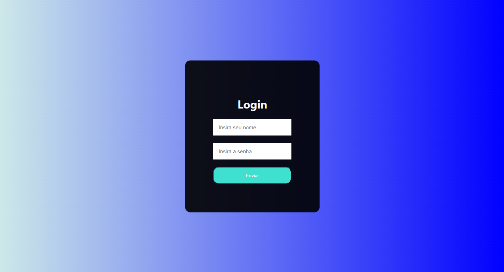

# Sistema de Login Simples

Este projeto é um sistema de login simples utilizando **HTML, CSS e JavaScript**. Ele valida o nome de usuário e a senha digitados, exibindo mensagens de erro caso estejam incorretos e redirecionando para uma tela de sucesso em caso de login bem-sucedido.

## 📌 Tecnologias Utilizadas

- **HTML5** → Estrutura da página
- **CSS3** → Estilização da interface
- **JavaScript** → Lógica de validação do login

## 📋 Funcionalidades

✅ Interface responsiva e amigável 📱💻  
✅ Validação de login com usuário e senha pré-definidos 🔑  
✅ Exibição de mensagem de erro para credenciais inválidas 🚫  
✅ Redirecionamento para a tela de sucesso após login correto ✅  

## 🎨 Capturas de Tela

### Tela de Login


### Tela de Sucesso

## 🚀 Como Executar o Projeto

1. **Clone o repositório:**
   ```sh
   git clone https://github.com/leonardoaqnn/sistema-login.git
   ```

2. **Acesse a pasta do projeto:**
   ```sh
   cd sistema-login
   ```

3. **Abra o arquivo `login.html` no navegador**

## 🔧 Configuração do Login

No arquivo `login.js`, os dados de login padrão são:
```js
var userDB = "admin";
var passDB = "1234";
```
Se desejar alterar, basta modificar esses valores.

## 📌 Estrutura do Projeto

```
📂 sistema-login
 ├── 📄 login.html  # Tela de login
 ├── 📄 login.css   # Estilos do login
 ├── 📄 login.js    # Lógica de validação do login
 ├── 📄 dashboard.html  # Página de sucesso pós-login
```

## 📜 Licença

Este projeto é de código aberto e pode ser modificado conforme necessário. 📜

---
🚀 Desenvolvido para fins educacionais e de prática. Contribuições são bem-vindas! 💡

